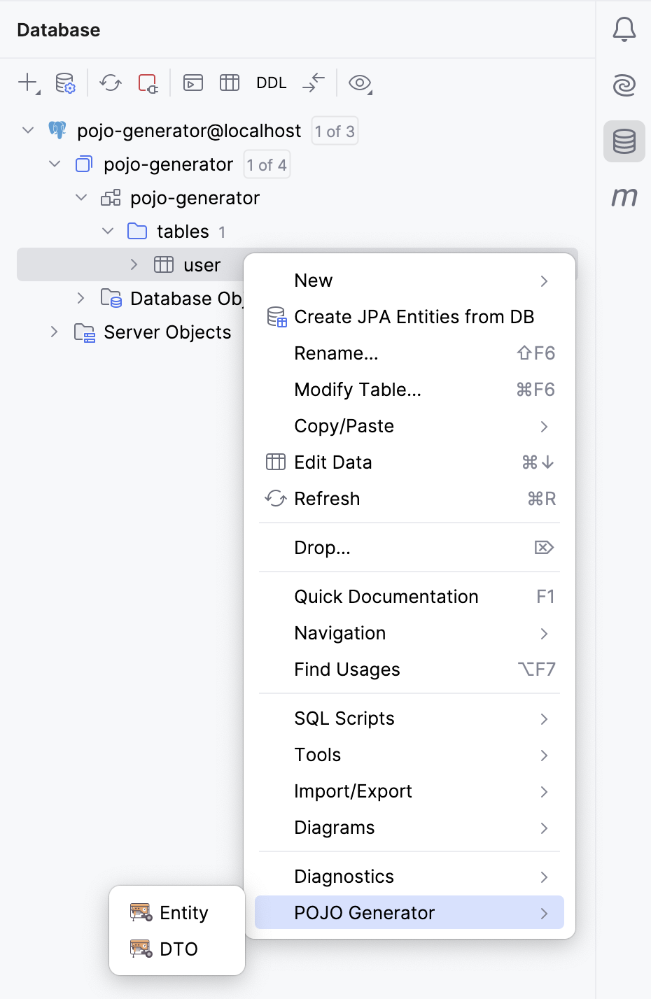
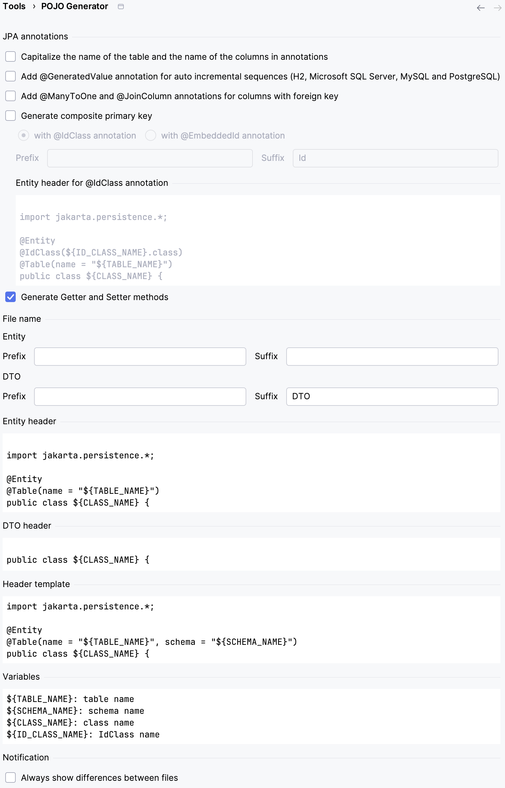

<h1>&nbsp;POJO Generator</h1>

Generate JPA Entity POJO from database table

## Usage

1. Right click on the table for generate a JPA Entity POJO or a Data Transfert Object POJO
2. Choose the path where to store the java file
3. The Java class is generated

Example of the User DTO class:

### Options

1. You can capitalize table name and column name in annotation
2. You can add `@GeneratedValue` annotation over column which have auto increment sequence (MySQL and PostgreSQL)
3. You can add `@ManyToOne` and `@JoinColumn` annotations on columns with foreign key
4. You can generate composite primary key with `@IdClass` or `@EmbeddedId` annotations

### JPA Mapping

You can change the JPA mapping and add new ones
